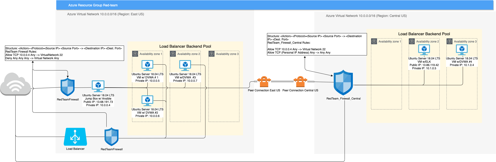
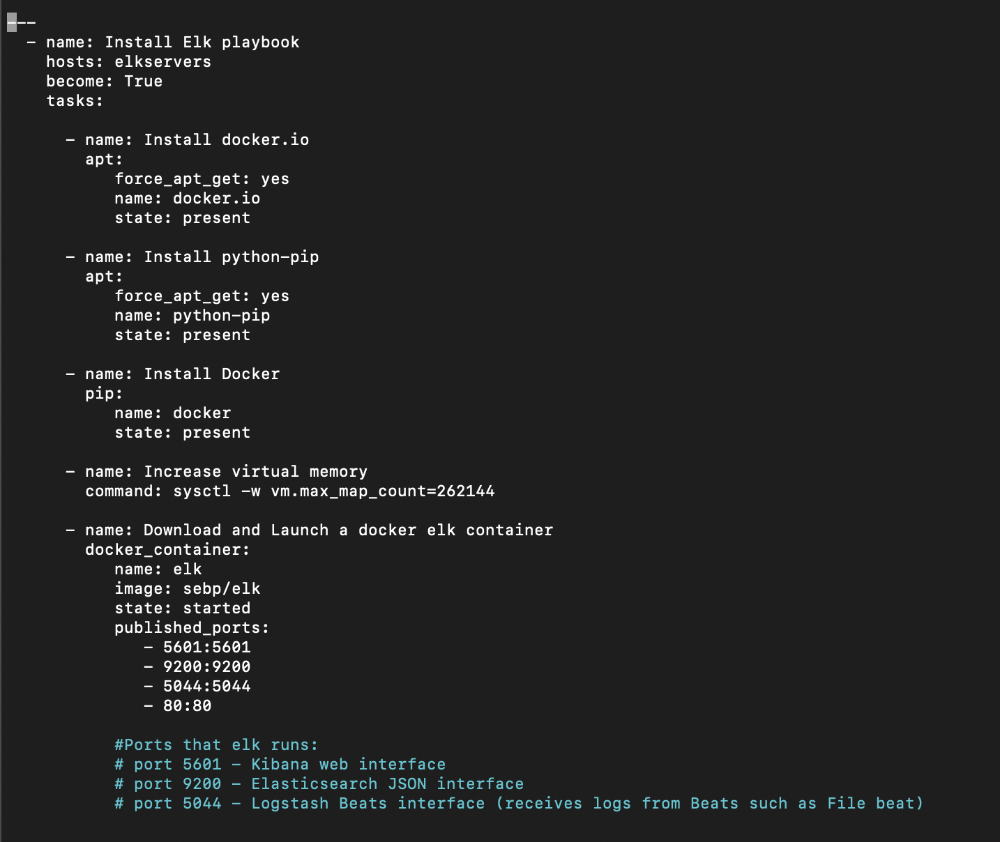
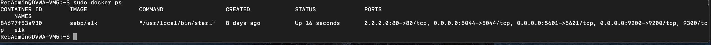

## Automated ELK Stack Deployment

The files in this repository were used to configure the network depicted below.

These files have been tested and used to generate a live ELK deployment on Azure. They can be used to either recreate the entire deployment pictured above. Alternatively, select portions of the _____ file may be used to install only certain pieces of it, such as Filebeat.

  - _TODO: Enter the playbook file._
  - 

This document contains the following details:
- Description of the Topologu
- Access Policies
- ELK Configuration
  - Beats in Use
  - Machines Being Monitored
- How to Use the Ansible Build

### Description of the Topology

The main purpose of this network is to expose a load-balanced and monitored instance of DVWA, the D*mn Vulnerable Web Application.

Load balancing ensures that the application will be highly _____, in addition to restricting _____ to the network.
- _TODO: What aspect of security do load balancers protect? What is the advantage of a jump box?_
- **Available/Access**
- **A load balancer protects an organizations accessibility**
- **The advantage of a jump box allows restriction of access to the nework and controlls who has authorization to access the network**

Integrating an ELK server allows users to easily monitor the vulnerable VMs for changes to the _____ and system _____.
- _TODO: What does Filebeat watch for?_
- **File beat is used to monitor the Log files of targeted VMs**
- _TODO: What does Metricbeat record?_
- **Metricbeat records the System performance of targeted VMs such as CPU usage, Memory use, and the speed rate of inbound and outbound traffic**

The configuration details of each machine may be found below.
_Note: Use the [Markdown Table Generator](http://www.tablesgenerator.com/markdown_tables) to add/remove values from the table_.

| Name     | Function    | IP Address             | Operating System |
|----------|-------------|------------------------|------------------|
| Jump Box | Gateway     | 10.0.0.4, 13.68.191.73 | Linux            |
| DVWA-VM1 |VM with DVWA | 10.0.0.5               | Linux            |
| DVWA-VM2 |VM with DVWA | 10.0.0.6               | Linux            |
| DVWA-VM3 |VM with DVWA | 10.0.0.7               | Linux            |
| DVWA-VM4 |VM with DVWA | 10.1.0.4               | Linux            |
| DVWA-VM5 |VM with Elk  | 10.1.0.5, 13.86.119.42 | Linux            |

### Access Policies

The machines on the internal network are not exposed to the public Internet. 

Only the _____ machine can accept connections from the Internet. Access to this machine is only allowed from the following IP addresses:
- _TODO: Add whitelisted IP addresses_
- **The jumpbox machine is the only one that can accept connections from the Internet.**
- **The elk VM allows internet connection to the elk webpage at port 80**
- **My personal ip address is whitelisted to allow access to the jumpbox**

Machines within the network can only be accessed by _____.
- _TODO: Which machine did you allow to access your ELK VM? What was its IP address?_
- **Machines within the network can only be accessed by the jumpbox. 10.0.0.4 is the whitelisted IP address of the jumbox so that it can access the VMs**

A summary of the access policies in place can be found in the table below.

| Name     | Publicly Accessible | Allowed IP Addresses       |
|----------|---------------------|----------------------------|
| Jump Box | Yes                 | (My Personal IP)           |
| DVWA-VM1 | No                  | 10.0.0.4                   |
| DVWA-VM2 | No                  | 10.0.0.4                   |
| DVWA-VM3 | No                  | 10.0.0.4                   | 
| DVWA-VM4 | No                  | 10.0.0.4                   |
| DVWA-VM5 | Yes                 | (My Personal IP), 10.0.0.4 |

### Elk Configuration

Ansible was used to automate configuration of the ELK machine. No configuration was performed manually, which is advantageous because...
- _TODO: What is the main advantage of automating configuration with Ansible?_
- **Automating configurations with ansible allows us to configure multiple VMs efficiently**

The playbook implements the following tasks:
- _TODO: In 3-5 bullets, explain the steps of the ELK installation play. E.g., install Docker; download image; etc._
-   **The playbook "install-elk.yml" used to install Elk on targeted VMs has the following tasks**
-   **1. Install Docker.io**
-   **2. Install Python**
-   **3. Install Docker**
-   **4. Increase VMs Virtual Memory**
-   **5. Download and Launch an elk container**

The following screenshot displays the result of running `docker ps` after successfully configuring the ELK instance.

### Target Machines & Beats
This ELK server is configured to monitor the following machines:
- _TODO: List the IP addresses of the machines you are monitoring_
- **10.0.0.5 : DVWA-VM1** 
- **10.0.0.6 : DVWA-VM2**
- **10.0.0.7 : DVWA-VM3**
- **10.1.0.4 : DVWA-VM4**

We have installed the following Beats on these machines:
- _TODO: Specify which Beats you successfully installed_
- **Filebeat**
- **Metribeat**

These Beats allow us to collect the following information from each machine:
- _TODO: In 1-2 sentences, explain what kind of data each beat collects, and provide 1 example of what you expect to see. E.g., `Winlogbeat` collects Windows logs, which we use to track user logon events, etc._
- **Filebeat collects log files to monitor and forwards them to a centralized location**
- **Metricbeat collects files from the os and server to monitor system and service performances fro mtargeted VMs**

### Using the Playbook
In order to use the playbook, you will need to have an Ansible control node already configured. Assuming you have such a control node provisioned: 

SSH into the control node and follow the steps below:
- Copy the _____ file to _____.
- Update the _____ file to include...
- Run the playbook, and navigate to ____ to check that the installation worked as expected.

_TODO: Answer the following questions to fill in the blanks:_
- _Which file is the playbook? Where do you copy it?_
- **You copy the .yml file and you copy it into the roles directory**
- **Use nano command to create a new .yml file and edit it. Use the cp command to copy the file and transfer into /etc/ansible/roles**
- _Which file do you update to make Ansible run the playbook on a specific machine? How do I specify which machine to install the ELK server on versus which to install Filebeat on?_
- **Update the host file in the ansible control node to include the specify machine. To specify which machines to install certain serivces, you group them under a group tag, and you use the tag in your playbook**
- **Use the nano command on the host file to update the file to include specific ip addresses of targeted VMs**
- _Which URL do you navigate to in order to check that the ELK server is running?
- **ssh to the VM containing the elk container  (ssh RedAdmin@10.1.0.5) and type the command docker ps to confirm it is running**
- **Use http://(Public IP address of the VM containing the ELK Server):5601 to confirm the ELK server is running**

_As a **Bonus**, provide the specific commands the user will need to run to download the playbook, update the files, etc._